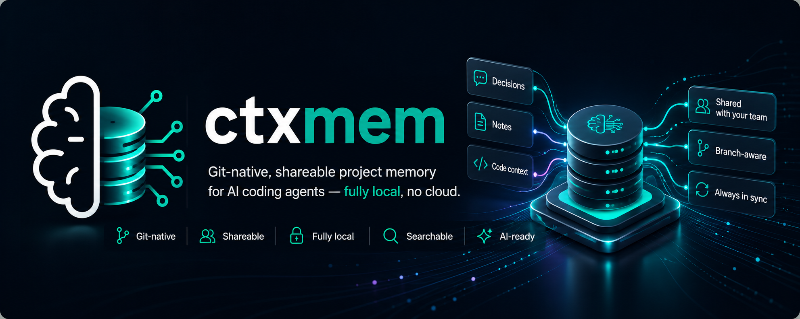
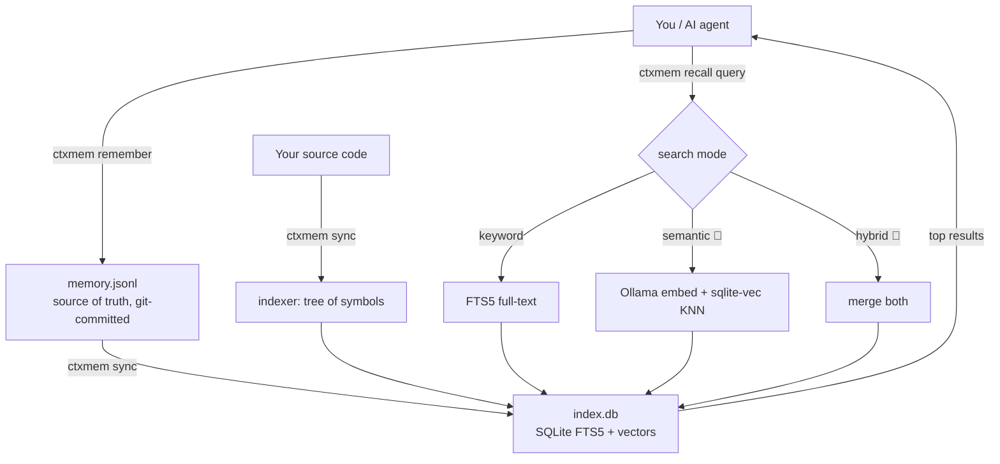
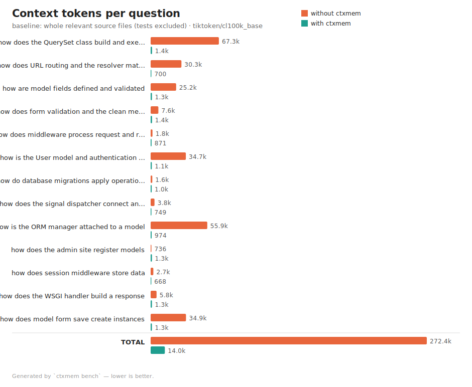

<div align="center">

<p align="center">
  
</p>

# ctxmem

**Git-native, shareable project memory for AI coding agents — fully local, no cloud.**

[](https://github.com/DoppiaG93/ctxmem/actions/workflows/test.yml)
[](https://github.com/DoppiaG93/ctxmem/actions/workflows/lint.yml)
[](LICENSE)
[](https://www.python.org/)
[](pyproject.toml)
[](https://modelcontextprotocol.io)

</div>

---

`ctxmem` gives your project a permanent, searchable memory that lives **inside the
repo**. AI agents (and you) can store decisions and recall relevant context on
demand, so nothing is forgotten when a chat exceeds the model's context window.

- 🧠 **Remembers** — decisions, notes, sessions + your code, in a searchable index.
- 🤝 **Shareable** — the memory is a text file committed to git. You commit, your
  colleague pulls, and they have *your exact context*. Branch-aware for free.
- 📦 **Works as a git package** — `pip install git+https://…`, zero required deps.
- 🔒 **Fully local** — SQLite files in your repo. No cloud, no API keys, no servers.
- 🔍 **Search modes** — `keyword` (built-in) plus `semantic` / `hybrid` (🧪 **beta**,
  local embeddings).

<p align="center">
  
</p>

---

## 📑 Table of contents

- [ctxmem](#ctxmem)
  - [📑 Table of contents](#-table-of-contents)
  - [🎯 1. The problem it solves](#-1-the-problem-it-solves)
  - [💡 2. The core idea](#-2-the-core-idea)
  - [🔄 3. How it works (data flow)](#-3-how-it-works-data-flow)
  - [🗂️ 4. Project structure](#️-4-project-structure)
    - [The modules in plain words](#the-modules-in-plain-words)
  - [📥 5. Install](#-5-install)
    - [Development checks](#development-checks)
  - [🚀 6. Quick start (5 minutes)](#-6-quick-start-5-minutes)
  - [🧭 7. Full walkthrough (install, agent, colleague)](#-7-full-walkthrough-install-agent-colleague)
    - [Step 1 — Add ctxmem to your codebase (once)](#step-1--add-ctxmem-to-your-codebase-once)
    - [Step 2 — Seed a few decisions (you, one line each)](#step-2--seed-a-few-decisions-you-one-line-each)
    - [Step 3 — Commit the memory so it can be shared](#step-3--commit-the-memory-so-it-can-be-shared)
    - [Step 4 — Let the AI agent remember on its own (optional but powerful)](#step-4--let-the-ai-agent-remember-on-its-own-optional-but-powerful)
    - [Step 5 — Your colleague gets the exact same context](#step-5--your-colleague-gets-the-exact-same-context)
    - [Recap: what's manual vs automatic](#recap-whats-manual-vs-automatic)
  - [📖 8. Commands reference](#-8-commands-reference)
    - [Measuring token savings (`bench`)](#measuring-token-savings-bench)
  - [📊 9. Benchmark — how it was tested](#-9-benchmark--how-it-was-tested)
  - [🔍 10. Search modes: keyword vs semantic vs hybrid](#-10-search-modes-keyword-vs-semantic-vs-hybrid)
  - [🤝 11. Sharing with your team](#-11-sharing-with-your-team)
  - [🪝 12. Auto-sync with a git hook](#-12-auto-sync-with-a-git-hook)
  - [🤖 13. Use it from an AI agent](#-13-use-it-from-an-ai-agent)
    - [Option A — instructions + CLI (recommended, no MCP needed)](#option-a--instructions--cli-recommended-no-mcp-needed)
    - [Option B — MCP server](#option-b--mcp-server)
  - [🧪 14. Semantic backend with Ollama (beta)](#-14-semantic-backend-with-ollama-beta)
    - [Option A — install Ollama on the host](#option-a--install-ollama-on-the-host)
    - [Option B — run Ollama in an isolated Lima VM](#option-b--run-ollama-in-an-isolated-lima-vm)
  - [❓ 15. FAQ](#-15-faq)
  - [🤝 16. Contributing](#-16-contributing)
  - [📄 17. License](#-17-license)

---

## 🎯 1. The problem it solves

Large language models have a **finite context window** (e.g. 200K tokens). When a
session grows past it, the model "forgets" decisions, files it read, and the
project's conventions. Worse, that context is trapped in one chat: it isn't
**shared** with teammates, and it has no notion of what changed between branches.

The fix is not to make the window bigger. It is to **keep the memory outside the
model** and feed back only the few relevant pieces when needed.

> **Principle:** the context window is a cache, not storage. The truth lives in an
> external, searchable index.

## 💡 2. The core idea

Two files under `.ctxmem/` in your repo:

```
.ctxmem/
├── memory.jsonl   # SOURCE OF TRUTH — committed to git.
│                  # Append-only, human-readable, one JSON object per line.
│                  # Holds your decisions / notes / sessions.
│
└── index.db       # DERIVED index — gitignored, rebuilt on demand.
                   # SQLite full-text (FTS5) + optional vector table.
                   # Holds a searchable copy of memory.jsonl PLUS your code symbols.
```

Why this split is the whole trick:

- **`memory.jsonl` is text in the repo** → it versions, diffs, and merges like any
  file. Switch branch → the memory changes with it. Push → your teammate gets it.
- **`index.db` is disposable** → anyone can rebuild it from `memory.jsonl` + the
  code on disk. So we never commit a binary; we commit readable history.

## 🔄 3. How it works (data flow)



- **Write:** `remember` appends a JSON line to `memory.jsonl` (and updates the index).
- **Index:** `sync` rebuilds `index.db` = replay `memory.jsonl` + scan the code for
  symbols (functions/classes) + optionally compute embeddings.
- **Read:** `recall` searches the index in the configured mode and returns the best
  matches — the small, relevant slice you (or the agent) actually need.

## 🗂️ 4. Project structure

```
ctxmem/
├── pyproject.toml            # Package metadata, CLI entry points, optional extras.
├── README.md                 # This file.
├── LICENSE                   # MIT.
├── .gitignore                # Ignores local package-maintainer state and build artifacts.
│
├── src/ctxmem/               # The Python package.
│   ├── __init__.py           # Package version marker.
│   ├── gitinfo.py            # Reads current git branch + commit (so memory is
│   │                         #   tagged with the context it was created in).
│   ├── store.py              # Storage layer: paths, config, the SQLite/FTS5 schema,
│   │                         #   insert/append/search/read helpers.
│   ├── indexer.py            # Scans source files and extracts code "symbols"
│   │                         #   (functions/classes) into searchable chunks.
│   ├── embeddings.py         # 🧪 beta: talks to Ollama for embeddings and to
│   │                         #   sqlite-vec for vector KNN search.
│   ├── retrieval.py          # The brain: rebuilds the index and dispatches a query
│   │                         #   to keyword / semantic / hybrid (with auto-fallback).
│   ├── bench.py              # Token-savings benchmark + SVG chart generation.
│   ├── cli.py                # The `ctxmem` command line (init, remember, recall, …).
│   └── mcp_server.py         # Exposes ctxmem to AI agents via the MCP protocol.
│
├── example/
│   ├── sample_app.py         # A tiny module so there is real code to index/recall.
│   └── bench/                # A sample generated benchmark report + charts.
│
├── ollama/                   # 🧪 beta: run the semantic backend in an isolated VM.
│   ├── lima.yaml             # Lima VM: Ubuntu + Ollama + the embedding model.
│   └── Taskfile.yaml         # `task start/stop/status/demo` helpers for the VM.
│
└── .ctxmem/                  # Created by `ctxmem init` in whatever repo you use it in.
    ├── memory.jsonl          # Committed source of truth.
    ├── config.json           # Committed: which search mode + model to use.
    ├── .gitignore            # Keeps index.db out of git.
    └── index.db              # Derived, local-only search index.
```

> Note: this `ctxmem` package repo is the exception: its own `.ctxmem/` is
> maintainer-local and gitignored. In projects that use `ctxmem`, commit
> `.ctxmem/memory.jsonl` and `.ctxmem/config.json`; ignore only `.ctxmem/index.db`.

### The modules in plain words

| File | Responsibility | Key functions |
|------|----------------|---------------|
| `gitinfo.py` | Know which branch/commit we're on. | `branch()`, `commit()` |
| `store.py` | Read/write files + SQLite. Defines the FTS5 table. | `memory_paths`, `load_config`, `init_schema`, `insert_row`, `append_jsonl`, `search` |
| `indexer.py` | Turn code files into searchable symbol chunks. | `extract_symbols`, `index_code` |
| `embeddings.py` 🧪 | Beta: local embeddings (Ollama) + vector KNN (sqlite-vec). | `available`, `embed`, `build`, `search` |
| `retrieval.py` | Rebuild the index; pick keyword/semantic/hybrid; fallback. | `rebuild`, `get_conn`, `search` |
| `bench.py` | Measure token / request savings; render SVG charts. | `count_tokens`, `baseline_text`, `svg_grouped_bars` |
| `cli.py` | The user-facing commands. | one `cmd_*` per subcommand |
| `mcp_server.py` | The agent-facing tools over MCP. | `recall`, `remember`, `memory_status` |

Both `cli.py` and `mcp_server.py` are thin: they call into `retrieval.py`, which
calls `store.py`, `indexer.py`, and (optionally) `embeddings.py`. One brain, two
front-ends.

## 📥 5. Install

```bash
# from a clone
pip install -e .

# as a git package (this is the "works as a git package" part)
pip install "git+https://github.com/DoppiaG93/ctxmem.git"

# with optional extras
pip install "ctxmem[mcp]"        # AI-agent server (MCP)
pip install "ctxmem[semantic]"   # 🧪 beta semantic search (sqlite-vec; needs Ollama too)
pip install "ctxmem[all]"        # everything
```

Requires **Python 3.8+** with FTS5 (bundled in virtually every `sqlite3` build).
The base install has **zero third-party dependencies**.

### Development checks

For local development, install the dev extra and run the same checks used by
GitHub Actions:

```bash
python -m pip install --upgrade pip
python -m pip install -e ".[dev]"
python -m pytest
python -m pylint src/ctxmem tests
ctxmem --help
```

`python -m pytest` runs the automated test suite. `python -m pylint src/ctxmem
tests` verifies the lint workflow locally. On GitHub, the workflows in
`.github/workflows/test.yml` and `.github/workflows/lint.yml` run automatically
on every push and pull request.

## 🚀 6. Quick start (5 minutes)

```bash
cd your-project

ctxmem init                                   # creates .ctxmem/
ctxmem remember --type decision \
  --title "Auth via JWT" --tags auth,security \
  "We chose stateless JWT over server sessions for horizontal scaling."

ctxmem sync                                   # also index your code
ctxmem recall "how do we handle authentication"   # ask in plain language
ctxmem recall "cart" --type symbol            # search only code symbols
ctxmem log                                     # recent memories
ctxmem status                                  # what's indexed
```

Then commit the memory so it's shared:

```bash
git add .ctxmem/memory.jsonl .ctxmem/config.json
git commit -m "chore: seed project memory"
```

## 🧭 7. Full walkthrough (install, agent, colleague)

A complete, realistic story: **you have your own package/codebase, you add ctxmem,
the AI agent starts remembering, and you hand the memory to a colleague.**

First, the key question up front:

> **Do I type commands by hand, or is it automatic?**
> Both — there are three levels, and you choose how much to automate:
>
> | What | Who does it | How |
> |------|-------------|-----|
> | Index the **code** | automatic | the git hook runs `ctxmem sync` on every commit |
> | Record a **decision** | you *or* the agent | you run `ctxmem remember`, **or** the AI calls the `remember` MCP tool for you |
> | **Recall** context | you *or* the agent | you run `ctxmem recall`, **or** the AI calls the `recall` MCP tool |
>
> The code index maintains itself. Decisions are written either by you (one
> command) or automatically by the agent once you wire up an instruction file
> and, optionally, MCP tools (Step 4 below).

### Step 1 — Add ctxmem to your codebase (once)

```bash
cd ~/code/my-awesome-package        # your existing repo

pip install "git+https://github.com/DoppiaG93/ctxmem.git"   # or: pip install -e ../ctxmem

ctxmem init                          # creates .ctxmem/ (keyword mode by default)
ctxmem hook install                  # auto-rebuild the index after every commit
ctxmem sync                          # first index of your existing code
```

What just happened:
- `.ctxmem/memory.jsonl` (empty for now) + `.ctxmem/config.json` were created.
- A `post-commit` hook now keeps the code index up to date by itself.
- Your code is already searchable: try `ctxmem recall "database connection"`.

### Step 2 — Seed a few decisions (you, one line each)

Write down the things you'd want a new teammate (or a fresh AI session) to know:

```bash
ctxmem remember --type decision --title "HTTP client" \
  "We use httpx (async) everywhere; do not add requests."

ctxmem remember --type decision --title "DB" --tags db \
  "Postgres via SQLAlchemy 2.0; migrations with Alembic."

ctxmem remember --type note --title "Gotcha" \
  "The worker must run with TZ=UTC or scheduling breaks."
```

Check them: `ctxmem log`.

### Step 3 — Commit the memory so it can be shared

```bash
git add .ctxmem/memory.jsonl .ctxmem/config.json
git commit -m "chore: seed project memory"
git push
```

Only the **source of truth** (`memory.jsonl`) and **config** are committed. The
`index.db` stays local (gitignored) and is rebuilt on demand.

### Step 4 — Let the AI agent remember on its own (optional but powerful)

So far you typed the commands. To make the **agent** do it automatically, create
the right instruction file for your tool:

```bash
ctxmem agent-init --agent codex      # writes/updates local AGENTS.md
ctxmem agent-init --agent copilot    # writes/updates .github/copilot-instructions.md
ctxmem agent-init --agent all        # writes both
ctxmem agent-init --agent all --mcp  # also writes .vscode/mcp.json
```

Codex reads `AGENTS.md` (often kept local and gitignored). GitHub Copilot reads
`.github/copilot-instructions.md`. The generated section is wrapped in ctxmem
markers, so re-running `agent-init` updates only that section.

The injected **Project Memory Protocol** tells the agent to `recall` before a
task, `remember` when it makes a decision, and `sync` after changing code. For
the full protocol text, the manual wiring, and MCP setup, see
[§13 Use it from an AI agent](#-13-use-it-from-an-ai-agent).

Now, in a normal chat, the agent recalls past decisions at the start and records
new ones as it goes — the memory grows by itself. You can still use the CLI
anytime; the agent and you write to the same memory.

### Step 5 — Your colleague gets the exact same context

```bash
git clone https://github.com/DoppiaG93/my-awesome-package && cd my-awesome-package
pip install "git+https://github.com/DoppiaG93/ctxmem.git"   # or your normal env setup

ctxmem hook install     # one-time: git doesn't share hooks, so each dev installs it
ctxmem recall "which HTTP client do we use"
#   [decision] HTTP client
#   We use httpx (async) everywhere; do not add requests.
```

They never ran `remember` — they simply pulled your `memory.jsonl`. The first
`recall` rebuilt their local `index.db` automatically. If they use Codex, they
can run `ctxmem agent-init --agent codex` to create their local `AGENTS.md`; if
the repo includes `.github/copilot-instructions.md` or `.vscode/mcp.json`,
those agent integrations travel with the repo.

> **Two one-time, per-machine steps** that git can't do for you: `pip install`
> ctxmem, and `ctxmem hook install` (git hooks live in `.git/`, which isn't
> pushed). Everything else travels in the repo.

### Recap: what's manual vs automatic

- **Automatic:** code indexing (git hook), index rebuild on `recall`, and — once
  Step 4 is set up — the agent recalling and recording decisions.
- **Manual (optional):** writing decisions yourself with `ctxmem remember`, and
  the two per-machine setup commands above.

## 📖 8. Commands reference

| Command | What it does |
|---------|--------------|
| `ctxmem init [--mode M]` | Create `.ctxmem/` and pick a search mode. |
| `ctxmem remember "text" [--type --title --tags --path]` | Store a memory (→ `memory.jsonl`). Types: `note`, `decision`, `session`, `todo`. |
| `ctxmem recall "query" [--limit --type --mode]` | Search memory + code. |
| `ctxmem sync` | Rebuild `index.db` from `memory.jsonl` + code (+ embeddings if enabled). |
| `ctxmem mode [M]` | Show, or switch to, `keyword` / `semantic` 🧪 / `hybrid` 🧪. |
| `ctxmem log [--limit]` | List recent memories. |
| `ctxmem status` | Branch/commit, mode, and counts of indexed items. |
| `ctxmem hook install`/`uninstall` | Add/remove a git post-commit auto-sync hook. |
| `ctxmem agent-init [--agent copilot\|codex\|all] [--mcp] [--force]` | Wire up agents: write the memory protocol into `.github/copilot-instructions.md` for Copilot, local `AGENTS.md` for Codex, or both. With `--mcp`, also write `.vscode/mcp.json`. |
| `ctxmem bench "query" [--baseline files\|memory\|repo]` | Measure **token savings** and **premium-request savings**: `recall` snippets vs feeding whole files/memory/repo. Add `--suite FILE --report DIR` for a full report with SVG charts. |
| `ctxmem --root PATH …` | Run against a repo other than the current directory. |

### Measuring token savings (`bench`)

`ctxmem bench` quantifies the whole point of the tool: instead of pasting whole
files (or the whole repo) into the model, you inject only the relevant `recall`
snippets. It reports **two** things — the context **tokens** you feed the model
and the number of **premium requests** (agent round-trips) the answer costs.

```bash
ctxmem bench "how is a marker structured"                 # snippets vs whole referenced files
ctxmem bench "how is a marker structured" --baseline repo # snippets vs the entire codebase
ctxmem bench "versioning" --baseline memory --type note   # snippets vs the whole memory.jsonl
```

```
  without ctxmem :    21306 tokens
  with ctxmem    :     1526 tokens
  saved          :    19780 tokens  (92.8%)
  reduction      :     14.0x smaller
  premium requests (estimated agent round-trips)
  without ctxmem :        6  (1 orient + 5 file reads)
  with ctxmem    :        1  (single recall)
  saved          :        5  (6.0x fewer)
```

Baselines: `files` (default — full text of the files behind the results),
`memory` (the whole `memory.jsonl`), `repo` (all indexed code + memory). Test
files are **excluded** from the baseline by default (`--include-tests` to keep
them), because a real agent would not paste whole test suites to answer a
question. Token counts use **tiktoken** when installed
(`pip install "ctxmem[bench]"`), otherwise a portable ~chars/4 estimate (the
label shows which was used).

Run a whole suite of questions and generate a shareable report with charts:

```bash
ctxmem bench --suite questions.txt --baseline files --report bench-out
# writes bench-out/report.md, bench-out/bench_tokens.svg, bench-out/bench_requests.svg
```

## 📊 9. Benchmark — how it was tested

The claim "ctxmem saves tokens and premium requests" is not hand-waving — it is
measured on a real, third-party codebase and fully reproducible.

**Setup**

- **Repo under test:** the [Django](https://github.com/django/django) source
  tree (~2,900 Python files, ~45k indexed symbols) — a large, independent codebase
  to avoid any home-field advantage.
- **Questions:** 15 real "onboarding" questions a developer would ask (QuerySet,
  URL routing, model fields, form validation, middleware, auth, migrations,
  signals, ORM manager, admin, sessions, WSGI, model forms). See
  [`example/bench_questions_django.txt`](example/bench_questions_django.txt).
- **"Without ctxmem" baseline:** the full text of the relevant **source** files
  an agent would otherwise open — **test files excluded**, because dumping entire
  test suites overstates the naive cost.
- **"With ctxmem":** only the snippets a single `ctxmem recall` returns.
- **Tokenizer:** `tiktoken` / `cl100k_base` (the GPT-4 / Copilot family).

**Results**

| Metric | Without ctxmem | With ctxmem | Improvement |
|---|--:|--:|--:|
| Context tokens (13 answerable questions) | 272,354 | 14,028 | **19.4× smaller** (94.8%) |
| Premium requests (agent round-trips) | 49 | 13 | **3.8× fewer** |

Context tokens per question:



Premium requests per question (billed **per model round-trip**, not per token —
without stored memory the agent orients itself and then opens each relevant file;
ctxmem returns every snippet in one `recall`):


**Reproduce it yourself**

```bash
git clone https://github.com/django/django ~/bench-django
cd ~/bench-django
pip install "ctxmem[bench]"
ctxmem init && ctxmem sync                       # index the repo (~seconds)
ctxmem bench --suite /path/to/bench_questions_django.txt \
    --baseline files --report bench-out
```

**Honest reading of these numbers**

- The token figure is the context you *feed the model*, not a Copilot bill.
  Token savings translate directly into money on **token-billed APIs**
  (OpenAI/Anthropic) and into more headroom under the context-window limit.
- For a **GitHub Copilot subscription** (billed in *premium requests*), the lever
  is the right-hand chart: fewer exploration round-trips per question.
- Not every query wins big — small files or broad questions save less, and the
  suite includes those too. The report is generated as-is, no cherry-picking.

## 🔍 10. Search modes: keyword vs semantic vs hybrid

| Mode | Finds results by | Needs | Speed | Default |
|------|------------------|-------|-------|---------|
| `keyword` | matching **words** (SQLite FTS5) | nothing | instant | ✅ |
| `semantic` 🧪 | matching **meaning** (embeddings) | sqlite-vec + Ollama | a bit slower | — |
| `hybrid` 🧪 | both, results merged | sqlite-vec + Ollama | a bit slower | — |

> 🧪 **`semantic` and `hybrid` are beta** — the local-embedding backend is
> experimental and under active testing. `keyword` mode is stable and needs no
> setup. If the semantic backend isn't available, ctxmem **automatically falls
> back to keyword** and tells you (`[keyword (fallback)]`).

- **keyword**: great, zero-setup baseline. Searching `"login"` won't find a note
  that only says `"authentication"`.
- **semantic** 🧪: understands meaning, so `"login"` *does* find `"authentication"`.
  Uses a local embedding model — no cloud.
- **hybrid** 🧪: runs both and merges — best recall.

The mode is stored in `.ctxmem/config.json` (so it's shared).

```bash
ctxmem init --mode hybrid
ctxmem mode                       # show current mode + backend availability
ctxmem mode semantic              # switch (beta)
ctxmem recall "auth" --mode keyword   # override for one query
```

## 🤝 11. Sharing with your team

The memory travels through git like code:

```bash
# you
ctxmem remember --type decision "Payments go through Stripe, not PayPal."
git add .ctxmem/memory.jsonl && git commit -m "memory: payments" && git push

# your colleague
git pull
ctxmem recall "payments"     # index rebuilds from memory.jsonl → same context
```

Because `memory.jsonl` is a normal file:

- **Branch-aware:** each branch carries its own decisions; switch branch and
  `recall` reflects it.
- **Merge-friendly:** append-only lines merge cleanly; conflicts are rare and
  readable.
- **No server:** nothing to host, nothing to sync — git *is* the transport.

## 🪝 12. Auto-sync with a git hook

Keep the index fresh automatically:

```bash
ctxmem hook install      # writes .git/hooks/post-commit
ctxmem hook uninstall
```

After every `git commit`, the index rebuilds so `recall` always reflects the
latest code and decisions. The hook uses your exact Python interpreter, so it
works from inside a virtualenv.

## 🤖 13. Use it from an AI agent

There are two ways to connect an agent (e.g. Codex or GitHub Copilot) to the
memory. They are independent — use whichever your setup allows.

### Option A — instructions + CLI (recommended, no MCP needed)

The agent already runs terminal commands, so it can drive the `ctxmem` CLI
directly. You just tell it *when* to `recall` and `remember` via an instructions
file. This works even when MCP is unavailable or disabled by policy.

Set it up in one command from your repo root:

```bash
ctxmem agent-init --agent codex      # writes/updates local AGENTS.md
ctxmem agent-init --agent copilot    # writes/updates .github/copilot-instructions.md
ctxmem agent-init --agent all        # writes both instruction files
ctxmem agent-init --agent all --mcp  # also drop a .vscode/mcp.json (for Option B)
```

This inserts a **Project Memory Protocol** between managed markers
(`<!-- ctxmem:begin -->` … `<!-- ctxmem:end -->`). It is **idempotent**: if the
file already exists it appends the section; re-running updates that section in
place without duplicating it or touching your other instructions.

Codex uses `AGENTS.md` (often kept local and gitignored). GitHub Copilot uses
`.github/copilot-instructions.md`. The default remains `--agent copilot` for
backward compatibility.

The protocol tells the agent to:

1. run `ctxmem recall "<the request>"` before a task, to load relevant context;
2. run `ctxmem remember …` when it makes or confirms an important decision;
3. run `ctxmem sync` after changing code.

Requirements & tips:

- **`ctxmem` must be on PATH** in the terminal the agent uses. If you installed it
  in a venv, expose it globally, e.g. `ln -s "$(command -v ctxmem)" ~/.local/bin/`.
- Use the agent in a mode that can run terminal commands (Codex, or VS Code
  Copilot **Agent** mode). Choose **"Always allow"** for `ctxmem` when your
  client offers command allow-listing.
- Start a **new chat** after `agent-init` so the updated instructions load.
- **Reality check:** LLMs are probabilistic — a strong, imperative protocol makes
  proactive saving *reliable*, not *guaranteed*. For 100% determinism, save
  explicitly (ask the agent, or run `ctxmem remember` yourself) or via the git hook.

### Option B — MCP server

`ctxmem` also ships an [MCP](https://modelcontextprotocol.io) server so agents can
call the memory as native tools. MCP is an **open standard** (MIT-licensed SDKs);
the server runs **locally** and reads only your repo.

```bash
pip install "ctxmem[mcp]"
```

Register it (VS Code `.vscode/mcp.json`, also created by `agent-init --mcp`):

```json
{
  "servers": {
    "ctxmem": {
      "command": "ctxmem-mcp",
      "env": { "CTXMEM_ROOT": "${workspaceFolder}" }
    }
  }
}
```

> If `ctxmem-mcp` isn't on the global PATH (e.g. it lives in a venv), use the
> absolute path to the binary as `command`.

Tools exposed to the agent:

- `recall(query, limit, type, mode)` — pull relevant context before a task.
- `remember(content, type, title, tags)` — record a decision when done.
- `memory_status()` — mode, branch/commit, index counts.

**The pattern (both options):** the agent calls `recall` at the start of a task
(injecting only the relevant snippets, staying well under the token limit) and
`remember` at the end — so the project's memory grows and persists across sessions.

## 🧪 14. Semantic backend with Ollama (beta)

> ⚠️ **Beta / experimental.** Semantic search works but is under active testing.
> Keyword mode remains the stable default. Expect the semantic setup and defaults
> to evolve in a future release.

Semantic search needs two open-source, fully-local pieces:

- **[Ollama](https://ollama.com)** runs an embedding model on your machine
  (offline, no API key). We use the small `nomic-embed-text` model.
- **[sqlite-vec](https://github.com/asg017/sqlite-vec)** stores the vectors and
  does nearest-neighbor search inside SQLite (a single loadable extension, no
  server).

### Option A — install Ollama on the host

```bash
pip install "ctxmem[semantic]"
# install Ollama from https://ollama.com, then:
ollama pull nomic-embed-text
ctxmem mode semantic
```

### Option B — run Ollama in an isolated Lima VM

Keeps Ollama off the host. Guest port `11434` is forwarded to the host, so ctxmem
(default `ollama_url = http://localhost:11434`) needs no extra config.

```bash
cd ollama
task start        # create VM, install Ollama, pull nomic-embed-text
task status       # verify the endpoint responds
task demo         # ctxmem mode semantic + a real query
task stop         # or: task delete   (fully reversible)
```

`ollama/lima.yaml` provisions Ubuntu 24.04, installs Ollama as a systemd service,
pulls the model, and includes a readiness probe. `ollama/Taskfile.yaml` wraps the
lifecycle in `task` commands.

## ❓ 15. FAQ

**Is my data sent anywhere?** No. Everything is local: SQLite files in your repo
and, if you enable the beta semantic mode, a local Ollama. The MCP server also
runs locally.

**Do I have to use embeddings?** No. `keyword` mode needs nothing and is the
default. Semantic is opt-in and still in beta.

**Should I commit `index.db`?** No — it's derived and gitignored. Commit
`memory.jsonl` and `config.json`.

**What if a teammate doesn't have Ollama?** ctxmem falls back to keyword
automatically; the shared memory still works.

**Does it scale to a big repo?** The keyword index is fine for large repos.
Embeddings cost one Ollama call per chunk on `sync`; for very large codebases
incremental (diff-based) indexing is a natural next step.

**Is MCP proprietary?** No. MCP is an open protocol with MIT-licensed SDKs. The
underlying LLM behind your agent may be proprietary, but the memory and the
protocol here are fully open and self-hosted.

## 🤝 16. Contributing

**Contributions are currently invite-only.** The project is developed by a small
set of invited collaborators, so unsolicited pull requests are not accepted right
now — but **bug reports and feature requests are always welcome** via
[GitHub issues](https://github.com/DoppiaG93/ctxmem/issues). If you would like to
contribute code, reach out to [@DoppiaG93](https://github.com/DoppiaG93) to be
added as a collaborator.

Invited collaborators follow the **Git Flow** branching model (`feature/*`,
`bugfix/*`, `hotfix/*` → `develop` → `main`); see the
**[Contributing guide](CONTRIBUTING.md)** for branch naming, commit conventions,
and the release process.

Please also review our [Code of Conduct](CODE_OF_CONDUCT.md). To report a security
issue, follow the [Security Policy](SECURITY.md) instead of opening a public issue.

## 📄 17. License

Released under the [MIT License](LICENSE).
