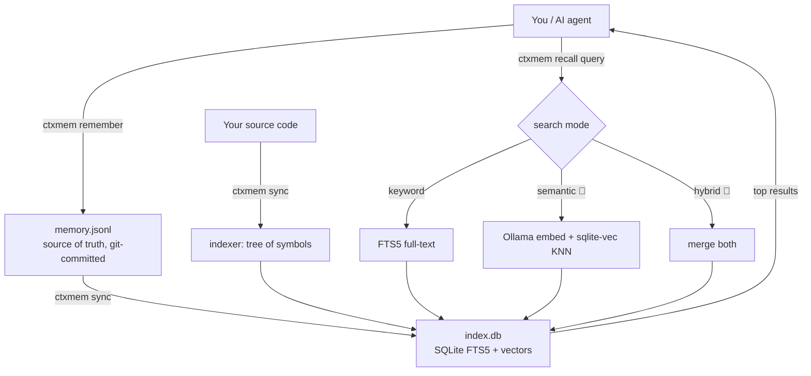

# ctxmem — Architecture & internals

How ctxmem works under the hood: the problem it solves, the data model, the
retrieval pipeline, the project layout, and the benchmark methodology.

← Back to the [README](../README.md) · See also the [Usage guide](GUIDE.md).

---

## 1. The problem it solves

Large language models have a **finite context window** (e.g. 200K tokens). When a
session grows past it, the model "forgets" decisions, files it read, and the
project's conventions. Worse, that context is trapped in one chat: it isn't
**shared** with teammates, and it has no notion of what changed between branches.

The fix is not to make the window bigger. It is to **keep the memory outside the
model** and feed back only the few relevant pieces when needed.

> **Principle:** the context window is a cache, not storage. The truth lives in an
> external, searchable index.

## 2. The core idea

Files under `.ctxmem/` in your repo:

```
.ctxmem/
├── memory.jsonl   # SOURCE OF TRUTH — committed to git.
│                  # Append-only, human-readable, one JSON object per line.
│                  # Holds your decisions / notes / sessions.
│
├── index.db       # DERIVED index — gitignored, rebuilt on demand.
│                  # SQLite full-text (FTS5) + optional vector table.
│                  # Holds a searchable copy of memory.jsonl PLUS your code symbols.
│
└── emb_cache.db   # DERIVED embedding cache — gitignored (semantic mode only).
                   # Keyed by content hash so a sync only calls the embedding
                   # backend for genuinely new or edited text.
```

Why this split is the whole trick:

- **`memory.jsonl` is text in the repo** → it versions, diffs, and merges like any
  file. Switch branch → the memory changes with it. Push → your teammate gets it.
- **`index.db` is disposable** → anyone can rebuild it from `memory.jsonl` + the
  code on disk. So we never commit a binary; we commit readable history.

## 3. How it works (data flow)



- **Write:** `remember` appends a JSON line to `memory.jsonl` (and updates the index).
- **Index:** `sync` rebuilds `index.db` = replay `memory.jsonl` + scan the code for
  symbols (functions/classes) + optionally compute embeddings. In semantic mode
  the embeddings are cached by content hash, so only new/changed text is re-embedded.
- **Read:** `recall` searches the index in the configured mode and returns the best
  matches — the small, relevant slice you (or the agent) actually need.

## 4. Project structure

```
ctxmem/
├── pyproject.toml            # Package metadata, CLI entry points, optional extras.
├── README.md                 # Short overview + essential commands.
├── docs/                     # This architecture doc + the usage guide.
├── LICENSE                   # MIT.
│
├── src/ctxmem/               # The Python package.
│   ├── __init__.py           # Package version marker.
│   ├── gitinfo.py            # Reads current git branch + commit (so memory is
│   │                         #   tagged with the context it was created in).
│   ├── store.py              # Storage layer: paths, config, the SQLite/FTS5 schema,
│   │                         #   insert/append/search/read helpers.
│   ├── indexer.py            # Scans source files and extracts code "symbols"
│   │                         #   (functions/classes) into searchable chunks.
│   ├── codemap.py            # Builds a structure + Python import map of the repo
│   │                         #   for `ctxmem map` (reuses indexer filters + ast).
│   ├── embeddings.py         # 🧪 beta: talks to Ollama for embeddings and to
│   │                         #   sqlite-vec for vector KNN search.
│   ├── retrieval.py          # The brain: rebuilds the index and dispatches a query
│   │                         #   to keyword / semantic / hybrid (with auto-fallback).
│   ├── bench.py              # Token-savings benchmark + SVG chart generation.
│   ├── cli.py                # The `ctxmem` command line (init, remember, recall, …).
│   └── mcp_server.py         # Exposes ctxmem to AI agents via the MCP protocol.
│
├── example/
│   ├── sample_app.py         # A tiny module so there is real code to index/recall.
│   └── bench/                # A sample generated benchmark report + charts.
│
├── ollama/                   # 🧪 beta: run the semantic backend in an isolated VM.
│   ├── lima.yaml             # Lima VM: Ubuntu + Ollama + the embedding model.
│   └── Taskfile.yaml         # `task requirements/enable/start/stop/status/demo` helpers.
│
└── .ctxmem/                  # Created by `ctxmem init` in whatever repo you use it in.
    ├── memory.jsonl          # Committed source of truth.
    ├── config.json           # Committed: which search mode + model to use.
    ├── .gitignore            # Keeps index.db + emb_cache.db out of git.
    ├── index.db              # Derived, local-only search index.
    └── emb_cache.db          # Derived, local-only embedding cache (semantic mode).
```

> Note: this `ctxmem` package repo is the exception: its own `.ctxmem/` is
> maintainer-local and gitignored. In projects that use `ctxmem`, commit
> `.ctxmem/memory.jsonl` and `.ctxmem/config.json`; ignore the derived
> `.ctxmem/index.db` and `.ctxmem/emb_cache.db`.

### The modules in plain words

| File | Responsibility | Key functions |
|------|----------------|---------------|
| `gitinfo.py` | Know which branch/commit we're on. | `branch()`, `commit()` |
| `store.py` | Read/write files + SQLite. Defines the FTS5 table. | `memory_paths`, `load_config`, `init_schema`, `insert_row`, `append_jsonl`, `search` |
| `indexer.py` | Turn code files into searchable symbol chunks. | `extract_symbols`, `index_code` |
| `codemap.py` | Build a structure + Python import map for `ctxmem map`. | `build_map` |
| `embeddings.py` 🧪 | Beta: local embeddings (Ollama) + vector KNN (sqlite-vec). | `available`, `embed`, `build`, `search`, `installed_models` |
| `retrieval.py` | Rebuild the index; pick keyword/semantic/hybrid; fallback. | `rebuild`, `get_conn`, `search` |
| `bench.py` | Measure token / request savings; render SVG charts. | `count_tokens`, `baseline_text`, `svg_grouped_bars` |
| `cli.py` | The user-facing commands. | one `cmd_*` per subcommand |
| `mcp_server.py` | The agent-facing tools over MCP. | `recall`, `ask`, `remember`, `memory_status` |

Both `cli.py` and `mcp_server.py` are thin: they call into `retrieval.py`, which
calls `store.py`, `indexer.py`, and (optionally) `embeddings.py`. One brain, two
front-ends.

## 5. Search modes: keyword vs semantic vs hybrid

| Mode | Finds results by | Needs | Speed | Default |
|------|------------------|-------|-------|---------|
| `keyword` | matching **words** (SQLite FTS5) | nothing | instant | ✅ |
| `semantic` 🧪 | matching **meaning** (embeddings) | sqlite-vec + Ollama | a bit slower | — |
| `hybrid` 🧪 | both, results merged | sqlite-vec + Ollama | a bit slower | — |

> 🧪 **`semantic` and `hybrid` are beta** — the local-embedding backend is
> experimental and under active testing. `keyword` mode is stable and needs no
> setup. If the semantic backend isn't available, ctxmem **automatically falls
> back to keyword** and tells you (`[keyword (fallback)]`).

- **keyword**: great, zero-setup baseline. Searching `"login"` won't find a note
  that only says `"authentication"`.
- **semantic** 🧪: understands meaning, so `"login"` *does* find `"authentication"`.
  Uses a local embedding model — no cloud.
- **hybrid** 🧪: runs both and merges — best recall.

The mode is stored in `.ctxmem/config.json` (so it's shared).

## 6. Semantic backend internals (incremental embeddings)

When semantic/hybrid mode is on, `sync` embeds every indexed row. Doing that from
scratch each time would call Ollama once per row — slow on large repos. Instead:

- Each row's text is hashed (`embeddings.text_hash`, SHA-256 of the content).
- Embeddings are cached in `.ctxmem/emb_cache.db` keyed by that hash, and the
  cache **survives full rebuilds** (it is a separate, gitignored file).
- On every `build()`, a row is only sent to Ollama when its content hash is not in
  the cache; unchanged memories and code symbols are served straight from cache.
- `index_fresh()` compares the **set of content hashes** in the index against the
  current rows, so a change that keeps the row count constant (e.g. a supersede
  that rewrites content) still forces a re-embed of just that row.

Code symbols get a fresh id on each rebuild, so the **content hash** — not the row
id — is the stable cache key. An older `index.db` without the `content_hash`
column is detected as not-fresh and rebuilt gracefully; no schema migration and no
change to the shared `memory.jsonl` format.

## 7. Benchmark — how it was tested

The claim "ctxmem saves tokens and premium requests" is not hand-waving — it is
measured on a real, third-party codebase and fully reproducible.

**Setup**

- **Repo under test:** the [Django](https://github.com/django/django) source
  tree (~2,900 Python files, ~45k indexed symbols) — a large, independent codebase
  to avoid any home-field advantage.
- **Questions:** 15 real "onboarding" questions a developer would ask (QuerySet,
  URL routing, model fields, form validation, middleware, auth, migrations,
  signals, ORM manager, admin, sessions, WSGI, model forms). See
  [`example/bench_questions_django.txt`](../example/bench_questions_django.txt).
- **"Without ctxmem" baseline:** the full text of the relevant **source** files
  an agent would otherwise open — **test files excluded**, because dumping entire
  test suites overstates the naive cost.
- **"With ctxmem":** only the snippets a single `ctxmem recall` returns.
- **Tokenizer:** `tiktoken` / `cl100k_base` (the GPT-4 / Copilot family).

**Results**

| Metric | Without ctxmem | With ctxmem | Improvement |
|---|--:|--:|--:|
| Context tokens (13 answerable questions) | 272,354 | 14,028 | **19.4× smaller** (94.8%) |
| Premium requests (agent round-trips) | 49 | 13 | **3.8× fewer** |

Context tokens per question:


Premium requests per question (billed **per model round-trip**, not per token —
without stored memory the agent orients itself and then opens each relevant file;
ctxmem returns every snippet in one `recall`):


**Reproduce it yourself**

```bash
git clone https://github.com/django/django ~/bench-django
cd ~/bench-django
pip install "ctxmem[bench]"
ctxmem init && ctxmem sync                       # index the repo (~seconds)
ctxmem bench --suite /path/to/bench_questions_django.txt \
    --baseline files --report bench-out
```

**Honest reading of these numbers**

- The token figure is the context you *feed the model*, not a Copilot bill.
  Token savings translate directly into money on **token-billed APIs**
  (OpenAI/Anthropic) and into more headroom under the context-window limit.
- For a **GitHub Copilot subscription** (billed in *premium requests*), the lever
  is the right-hand chart: fewer exploration round-trips per question.
- Not every query wins big — small files or broad questions save less, and the
  suite includes those too. The report is generated as-is, no cherry-picking.
